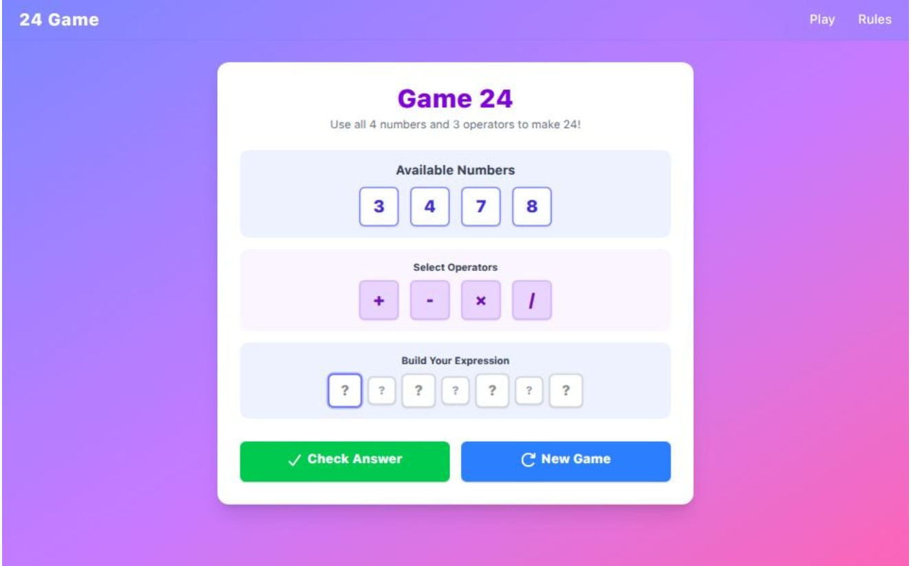

# Game 24

This is a [Next.js](https://nextjs.org) project for the Game 24 web application.


Play game click --> [Play Game 24](https://game-24-lyart.vercel.app/play)

## Project Structure

```
app/
	globals.css         # Global styles
	layout.tsx          # Root layout
	page.tsx            # Home page
	component/          # Shared React components
		checkIcon.tsx
		clearIcon.tsx
		navBar.tsx
		reload.tsx
	play/               # Play game page
		page.tsx
	rules/              # Game rules page
		page.tsx
public/                # Static assets
types/                 # TypeScript types and validators
	cache-life.d.ts
	routes.d.ts
	validator.ts
```

## Getting Started

Install dependencies:

```bash
pnpm install
# or
yarn install
# or
npm install
```

Run the development server:

```bash
pnpm dev
# or
yarn dev
# or
npm run dev
```

Open [http://localhost:3000](http://localhost:3000) to view the app.

## Features

- Play the Game 24 puzzle interactively
- View game rules
- Responsive UI with reusable components
- TypeScript for type safety

## Customization

- Add or edit components in `app/component/`
- Update game logic or types in `types/`

## Deployment

You can deploy this app on [Vercel](https://vercel.com/) or any platform that supports Next.js.

## Learn More

- [Next.js Documentation](https://nextjs.org/docs)
- [Vercel Deployment Docs](https://nextjs.org/docs/app/building-your-application/deploying)
